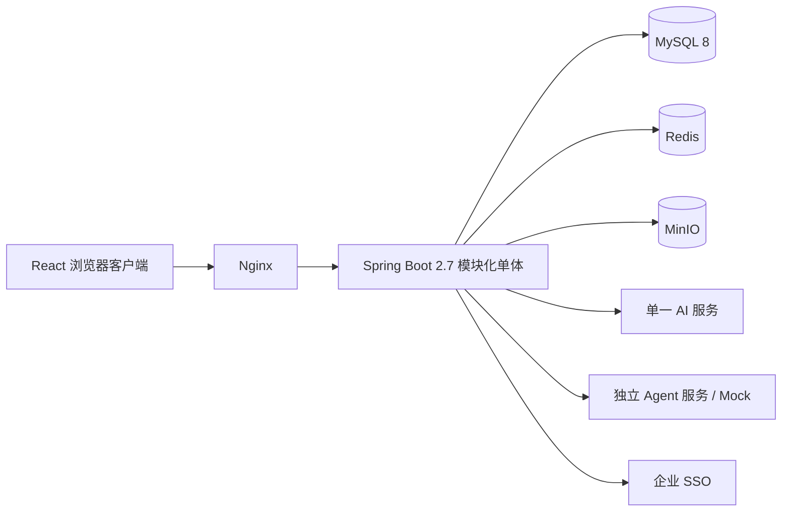

# 智鹿交付项目管理平台设计规格

> 日期：2026-07-13  
> 状态：已批准  
> 源资料：`/Users/dogekul/Downloads/交付范式`  
> 工程目录：`/Users/dogekul/Documents/交付范式`

## 1. 目标

把现有“交付范式”中的指南、模板、范例、28 个功能 Spec 和静态交互原型建设成可供内部团队真实使用的生产系统。

系统服务单一公司内的多个团队和产品线，首期容量按不超过 100 名用户、500 个项目和约 1 TB 附件设计。最终交付全部 6 个模块、28 个功能；建设过程分里程碑推进，但本次任务不以 P0 为终点。

验收采用功能交付标准：28 个功能可用，核心流程与接口有自动化测试，具备数据库迁移、演示数据、Docker Compose 和基础运维文档。

## 2. 已确认的技术决策

| 领域 | 决策 |
|------|------|
| 前端 | React 18、TypeScript、Vite、Ant Design 主题化 |
| 后端 | Java 8、Spring Boot 2.7 模块化单体、REST API |
| 数据 | MySQL 8 为唯一业务事实源 |
| 缓存 | Redis 用于会话、缓存和短期任务状态，不保存唯一业务事实 |
| 文件 | MinIO 保存正文、附件和版本文件，MySQL 保存元数据 |
| 部署 | Linux + Docker Compose，Nginx 统一入口 |
| 身份 | 内置账号与企业统一登录兼容；单公司、多团队/产品线 |
| 权限 | 六类预置角色，管理员可调整菜单和操作权限；项目成员关系控制项目数据范围 |
| AI | 首期单一 OpenAI-compatible HTTP 模型服务，地址、模型和密钥由环境变量配置；未来扩展多供应商适配 |
| Agent | 独立 Agent 服务由其他团队建设；本工程定义契约、异步任务状态机和 Mock Agent |
| 架构 | 模块化单体 + 显式状态机；不引入微服务、工作流引擎和消息队列 |

## 3. 范围

### 3.1 共享平台底座

- 本地登录、企业 SSO 适配、用户与团队管理
- 预置角色、可配置菜单/操作权限、项目级数据权限
- 产品目录、标品版本、系统字典和全局配置
- 文件上传、版本、下载、预览元数据与 MinIO 生命周期
- 审计日志、项目活动日志、统一异常和操作幂等
- AI Client、Agent Client、异步任务、回调验签和 Mock Agent

### 3.2 六模块、二十八功能

| 模块 | 功能 |
|------|------|
| M1 驾驶舱 | 项目卡片墙、风险热力图、全局矩阵视图、快速创建项目 |
| M2 项目空间 | 七阶段生命周期看板、Skill/Agent 执行面板、模板中心、项目风险登记册、里程碑与时间线、项目信息与设置 |
| M3 需求工坊 | 需求采集单、AI 分类决策树、三层漏斗可视化、需求去重与合并、需求列表与看板 |
| M4 标准化中心 | 标品能力卡、标准化成熟度评估、偏离度分析、标准化债务清单、二开成本归因、飞轮仪表盘 |
| M5 知识库 | 范例检索、二开代码片段库、培训材料管理 |
| M6 资源中心 | 团队人员墙、项目人力配置、资源冲突检测、团队负载看板 |

### 3.3 明确不做

- SaaS 多租户
- 微服务拆分、消息队列、BPMN 工作流引擎
- 多人实时协同编辑
- 外部 Jira 双写、代码仓库集成、企业消息推送
- 全功能移动端；桌面端为主，关键页面只保证响应式可读
- 细粒度字段级权限和自定义报表设计器

## 4. 总体架构

前端是一个 React 单页应用。Nginx 提供静态资源、HTTPS 终止和 `/api` 反向代理。后端是一个部署单元，所有业务模块共享同一 MySQL，但按模块拥有自己的表和服务边界。

模块间写操作通过应用服务或同进程领域事件完成，不直接修改其他模块的数据表。M1 使用面向查询的聚合 SQL/视图生成驾驶舱读模型，不承担其他模块的业务写入。

## 5. 后端模块边界

采用按功能分包，而不是全局 `controller/service/repository` 分层。每个模块自含 API、应用服务、领域对象、数据访问和测试。

| 模块 | 主要职责 | 依赖 |
|------|----------|------|
| `iam` | 用户、团队、角色、权限、本地登录、SSO 身份映射 | 共享安全组件 |
| `catalog` | 产品、版本、字典、能力卡基础目录 | `iam` |
| `project` | 项目、七阶段、里程碑、风险、模板实例、活动 | `iam`、`catalog`、`resource` |
| `requirement` | 需求、分类、漏斗、去重、二开任务 | `project`、`catalog`、`ai` |
| `standardization` | 成熟度、偏离度、债务、成本、飞轮 | `requirement`、`catalog` |
| `knowledge` | 范例、代码片段、培训材料、检索 | `catalog`、`storage` |
| `resource` | 人员画像、项目配置、冲突、负载 | `iam`、`catalog` |
| `automation` | Agent Job、AI 调用、回调、重试、产出物归档 | `project`、`storage` |
| `dashboard` | M1 聚合查询和统计投影 | 只读访问业务数据 |
| `storage` | MinIO 对象、文件版本与访问授权 | `iam` |
| `audit` | 审计和统一活动记录 | 所有写模块 |

## 6. 前端信息架构与视觉设计

现有静态原型作为页面流程、字段、示例数据和交互语义的基线，不直接复制为生产代码。

- 使用浅色双层导航：窄功能轨 + 模块侧栏。
- 风格参考飞书项目：蓝色主色、克制阴影、紧凑间距、清晰状态色。
- 驾驶舱默认使用高密度项目列表，并保留列表/卡片切换。
- React 路由与六个业务模块一一对应，共享筛选条、状态标签、表格、卡片、抽屉、步骤条、文件区和异步任务面板。
- 服务端状态由查询缓存统一管理；表单状态保持在功能组件内，不建立额外全局业务状态仓库。
- 所有列表提供加载、空状态、错误、无权限和边界状态。

## 7. 领域模型

### 7.1 身份与目录

`Organization`、`Team`、`User`、`SsoIdentity`、`Role`、`Permission`、`Product`、`ProductVersion`。

### 7.2 项目聚合

`DeliveryProject` 是聚合根，关联 `ProjectMember`、`StageInstance`、`Milestone`、`ProjectRisk`、`TemplateInstance`、`Artifact` 和 `ActivityLog`。

项目统一使用七阶段：

1. 启动
2. 需求采集
3. 二开实施
4. 上线切换
5. 试运行与移交
6. 标准化评估
7. 项目收尾

项目状态为 `DRAFT → ACTIVE → SUSPENDED → CLOSING → CLOSED`。阶段状态为 `PENDING → ACTIVE → COMPLETED`，异常时可为 `BLOCKED`。阶段门禁支持警告和阻断两种模式。

### 7.3 需求与标准化

需求模型包含 `Requirement`、`ClassificationDecision`、`DuplicateRelation` 和 `CustomDevTask`。AI 结果只是建议；只有人工确认或改判后的分类结论才能进入漏斗、成本和标准化统计。

标品由 `ProductBaseline` 表达，包含功能范围、配置目录和扩展点目录。标准化模型包含 `MaturityAssessment`、`StandardizationDebt`、`CostAttribution` 和 `FlywheelMetric`。

债务状态为 `CANDIDATE → PENDING → INCLUDED → VERIFYING → CLOSED`。

### 7.4 知识、资源与自动化

- 知识：`KnowledgeItem`、`DeliveryExample`、`CodeSnippet`、`TrainingMaterial`、`FileObject`、`FileVersion`。
- 资源：`EngineerProfile`、`ProjectAssignment`、`ResourceConflict`、`LoadSnapshot`。
- 自动化：`AgentJob`、`AgentAttempt`、`AiDecision`、`CallbackReceipt`。

Agent Job 状态为 `QUEUED → RUNNING → SUCCEEDED`，终止状态还包括 `FAILED`、`TIMED_OUT` 和 `CANCELLED`。

## 8. 关键数据流

### 8.1 快速创建项目

1. 用户录入客户、合同、产品和标品版本。
2. 单个 MySQL 事务创建项目、七个阶段、初始成员和里程碑。
3. 事务提交后创建 `/deliver-init` Agent Job。
4. Agent 产出文件写入 MinIO，元数据和项目 Artifact 写入 MySQL。
5. Agent 失败不回滚项目，项目保留“待初始化”提示，支持重试或人工补齐。

### 8.2 需求分类与标准化回流

1. 录入需求并选择项目。
2. AI 使用需求、标品能力卡和相似历史记录生成 L0/L1/L2 建议、置信度和理由。
3. 工程师确认或改判；改判必须记录原因。
4. 确认结论更新项目漏斗。L1 自动生成二开任务并执行历史片段匹配。
5. 同一产品/版本下的高频 L1 模式形成标准化债务候选，由 PMO 确认后进入债务生命周期。

### 8.3 Agent 异步执行

1. 前端提交任务，后端先创建 `AgentJob`。
2. 后端调用外部 Agent 的提交接口并记录 `externalJobId`。
3. 前端每 2 秒查询本系统任务状态；不建立 WebSocket。
4. Agent 可回调状态与产出物，后端也可主动轮询外部状态。
5. 回调使用 `externalJobId + eventId` 幂等；超时任务由定时补偿扫描。
6. 产出物先写 MinIO，再在 MySQL 事务中绑定 Artifact；绑定失败时由补偿任务清理孤儿对象。

## 9. Agent 与 AI 契约

### 9.1 Agent 契约

外部 Agent 暴露：

- `POST /v1/jobs`：提交 Skill、上下文摘要、输入文件签名 URL 和回调地址。
- `GET /v1/jobs/{externalJobId}`：查询状态和产出物清单。
- `POST /v1/jobs/{externalJobId}/cancel`：取消尚未完成的任务。

本系统暴露 `POST /api/v1/integrations/agent/events` 接收回调。请求包含唯一 `eventId`、任务状态、进度、错误和产出物。双方使用时间戳与 HMAC-SHA256 请求签名，拒绝超过五分钟的请求和重复事件。

开发与自动化测试使用同一契约的 Mock Agent。真实 Agent 的地址和共享密钥通过环境变量切换，不改变业务代码。

### 9.2 AI 契约

首期只实现一个 OpenAI-compatible `chat/completions` 客户端。配置包含 base URL、model、API key、连接超时和读取超时。分类、去重和推荐使用结构化 JSON 输出，并在入库前进行 schema 校验。未来增加供应商时，在 `ai` 模块新增适配器，不改变业务接口。

## 10. 身份、权限与审计

预置角色为：系统管理员、PMO、交付负责人、交付工程师、技术经理、产品经理。

- 系统管理员维护用户、团队、角色权限和系统配置。
- PMO 可查看跨产品、跨项目数据并管理资源和标准化分析。
- 交付负责人可管理其负责项目、风险、里程碑和人员配置。
- 交付工程师可操作其参与项目的阶段、模板、需求和 Agent 任务。
- 技术经理可审核二开、维护代码片段和技术风险。
- 产品经理可维护所属产品的能力卡和标准化债务。

授权规则由“角色操作权限 + 数据范围”共同决定。跨项目查询必须经过数据范围过滤；后端是最终授权边界，前端菜单隐藏不代替接口鉴权。登录、权限变更、业务状态变更、文件下载和 Agent/AI 调用进入审计日志。

## 11. 错误处理与一致性

- API 统一返回错误码、用户消息、追踪 ID 和字段级校验错误；不向前端暴露堆栈。
- 可编辑聚合使用版本号进行乐观锁，冲突返回 409 并提示刷新。
- 创建、合并、回调和 Agent 提交使用幂等键，避免重复记录。
- 外部 AI/Agent 调用设置连接与读取超时；只对网络错误和 5xx 做有限指数退避，不重试业务 4xx。
- 所有外部调用遵循“先落库、后调用、可补偿”；网络失败不会丢失本地业务数据。
- 文件上传校验大小、扩展名、MIME 和对象 key；失败时清理临时对象。
- 统计读模型允许短暂延迟，项目、分类、权限和文件元数据保持强一致。

## 12. 测试设计

功能交付标准下，测试集中在高风险逻辑和核心闭环。

- 后端单元测试：状态机、权限数据范围、漏斗计算、成熟度、债务触发、成本归因、资源冲突、Agent 幂等和重试。
- 后端集成测试：登录、项目创建、分类确认、文件归档、Agent 回调、主要 CRUD API 和数据库迁移。
- 前端组件测试：权限菜单、四态页面、关键表单、列表/卡片切换和异步任务面板。
- 端到端测试：内置账号登录；创建项目；推进阶段；提交并确认需求分类；执行 Mock Agent；查看驾驶舱；配置人员并识别冲突；创建债务并完成验证。
- Docker Compose 冒烟测试：服务健康检查、迁移、演示数据、MinIO 上传下载和 Mock Agent 回调。

不追求每个简单 CRUD 的逐字段端到端覆盖，但每个模块至少有一条成功路径和一条权限/异常路径。

## 13. 部署与配置

Docker Compose 包含：

- `web`：Nginx + React 静态资源
- `api`：Spring Boot 应用
- `mysql`
- `redis`
- `minio`
- `mock-agent`：开发和验收环境启用

配置通过 `.env` 注入，仓库只提交 `.env.example`。生产密钥不进入 Git。Flyway 在 API 启动时执行迁移；演示数据使用独立 profile 初始化，生产默认关闭。

## 14. 交付里程碑

1. **平台基础**：工程骨架、设计系统、身份权限、产品目录、文件、审计、Compose。
2. **P0 核心闭环**：项目列表/卡片、快速创建、七阶段、Agent 面板、需求采集和 AI 分类。
3. **P1 业务覆盖**：风险热力图、矩阵、模板、里程碑、漏斗、需求列表、能力卡、债务、范例、人员墙和人力配置。
4. **P2 完整能力**：剩余项目、需求、标准化、知识和资源功能。
5. **集成验收**：权限、Mock Agent、演示数据、自动化测试、Compose 冒烟和文档。

所有里程碑都属于本次交付范围。

## 15. 完成标准

- 六模块、二十八功能均有可访问页面和真实后端数据流。
- 六类角色的菜单、操作和数据范围有效。
- 本地登录可用，SSO 具备可运行的 OIDC 接入方式。
- 核心七阶段、分类、债务和 Agent 状态机受后端约束。
- 文件真实写入 MinIO，元数据和版本真实写入 MySQL。
- Mock Agent 可完成六个 `/deliver-*` 任务的成功、失败和超时演示。
- AI 客户端在配置真实服务时可调用；未配置时明确返回“服务未配置”，不伪造生产结果。
- 核心自动化测试通过，Docker Compose 可从空环境启动并载入演示数据。
- README、部署说明、Agent 契约和接口文档齐全。

