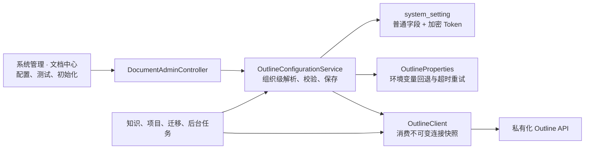

# Outline 管理页配置设计

## 1. 背景与目标

现有 Outline 文档中心已经承担知识库和项目文档的正文、目录及修订存储，但连接参数仍来自部署环境变量。管理员无法在系统内完成首次配置、连接验证或后续凭据轮换，当前页面只能提示“尚未配置”。

本次改造把 Outline 连接配置加入“系统管理 → 文档中心”，实现：

- 每个组织独立维护自己的 Outline 连接和目标 Collection。
- 管理员在页面中保存配置并立即生效，无需重启后端。
- 支持测试 Outline 服务、API Token 和 Collection 访问权限。
- API Token 加密入库，前端、日志和审计均不回显明文。
- 兼容现有环境变量配置，升级后无需立即迁移。
- 防止配置切换造成已有知识和项目文档映射失效。

本文补充并覆盖《Outline 统一文档中心设计》中“API Key 不写入数据库”的部署约束；文档正文、目录、修订、权限和项目流程等其他设计保持不变。

## 2. 已确认的产品决策

- 配置按当前登录用户的 `organizationId` 隔离，不做全平台共享配置。
- 配置入口放在现有 `/admin/document-center` 页面，不新建重复的系统设置页面。
- 页面字段包括后端服务地址、浏览器访问地址、Collection 链接或 UUID、API Token。
- 保存和测试均只允许具有 `system:manage` 权限的用户执行。
- 保存后所有新请求和后台文档任务立即读取最新配置。
- API Token 只允许设置或覆盖；读取接口只返回“是否已配置”，不返回密文或明文。
- API Token 输入留空表示保留当前有效 Token。
- Collection 输入兼容 UUID、URL ID 和完整 Collection 链接；连接验证后保存 Outline 返回的规范 UUID。
- 已存在 Outline 文档映射时，不允许直接切换到其他 Collection。
- 环境变量保留为组织尚未保存对应字段时的兼容回退。

## 3. 方案比较

### 3.1 采用：组织级数据库配置，运行时解析

配置保存到已有 `system_setting` 表，并按组织读取。Outline 客户端每次调用显式携带组织 ID，由配置服务解析该组织的有效连接。

优点：

- 符合系统现有多组织隔离模型。
- 保存后立即生效，支持多后端实例。
- 不需要修改容器文件或重启服务。
- 可以继续使用环境变量作为升级回退。

代价是需要把当前全局 Outline 客户端改为组织感知，但这是避免跨组织串用凭据的必要改造。

### 3.2 不采用：管理页改写 `.env`

容器内文件不一定可写，修改后通常还需要重启服务；多实例部署也无法保证一致。页面写部署文件还会扩大凭据暴露和运维风险。

### 3.3 不采用：修改全局 `OutlineProperties` 单例

实现较少，但只能支持全平台一套配置；多组织会共享服务和 Token，多实例之间也不能可靠同步，不符合已确认的隔离要求。

## 4. 总体架构



关键约束：

- 业务服务必须使用 `OutlineConfigurationService.resolve(organizationId)` 生成的连接快照调用 Outline 客户端。
- 连接快照包含所属组织 ID；客户端不能依赖线程变量、当前登录会话或可变全局单例选择配置。
- 后台任务从任务记录中的 `organization_id` 解析配置，与前台请求使用同一逻辑。
- 浏览器永远不直接调用 Outline API，也不持有 API Token。

## 5. 配置模型

继续使用已有 `system_setting` 表，不新增业务表：

| `setting_key` | 存储内容 | `encrypted` |
| --- | --- | --- |
| `outline.baseUrl` | 后端访问 Outline 的服务根地址 | `false` |
| `outline.publicBaseUrl` | 浏览器跳转 Outline 的公开根地址 | `false` |
| `outline.collectionId` | 验证后得到的规范 Collection UUID | `false` |
| `outline.collectionName` | 最近一次保存验证得到的 Collection 名称 | `false` |
| `outline.apiToken` | 版本化加密密文 | `true` |

### 5.1 有效配置解析

每个字段优先读取当前组织数据库配置；组织没有保存时读取现有 `OutlineProperties` 环境值。连接超时、读取超时、任务重试次数和退避时间仍是部署级参数，不放入管理页。

有效配置由不可变对象表示，至少包含：

- `baseUrl`
- `publicBaseUrl`
- `apiToken`
- `collectionId`
- 配置来源

任何 Outline 操作开始前都解析一次有效配置。后台任务执行期间使用本次解析结果，不在同一次远程调用中途切换配置。

### 5.2 Token 加密

使用 Spring Security 已有加密能力，不新增第三方依赖。密文格式包含版本、随机盐和加密结果，以支持后续密钥轮换或算法升级。

主密钥来自部署级 `delivery.settings.encryption-key`：

- 生产环境必须通过 `SETTINGS_ENCRYPTION_KEY` 提供稳定高强度密钥。
- 本地开发可回退到现有 `AGENT_SHARED_SECRET`，保证当前 Compose 环境可以直接使用。
- 主密钥不写入数据库，也不通过管理接口返回。
- 主密钥缺失或密文无法解密时，禁止覆盖成明文，并返回明确的配置错误。

Token 的读取接口只返回：

```json
{
  "apiTokenConfigured": true
}
```

保存请求中的 Token 为空时保留原有效 Token；非空时加密后覆盖。日志、异常、审计详情和 HTTP 响应均不得包含请求 Token、密文或 Authorization Header。

## 6. 后端接口

在现有 `/api/v1/admin/document-center` 下增加：

### 6.1 读取配置

`GET /config`

返回当前组织可展示的有效配置：

```json
{
  "baseUrl": "http://host.docker.internal:3000",
  "publicBaseUrl": "http://localhost:3000",
  "collectionId": "a4296a54-2044-4529-ba86-d598a5322e06",
  "collectionName": "智鹿交付",
  "apiTokenConfigured": true,
  "source": "ORGANIZATION"
}
```

首次使用环境变量回退时，`source` 可为 `ENVIRONMENT`；部分字段已保存时为 `MIXED`。环境变量不包含 Collection 名称时，`collectionName` 可以为空，页面仍通过状态接口显示连接结果。读取配置只查询本地数据，不因 Outline 暂时不可用而失败。响应不包含 API Token。

### 6.2 测试草稿配置

`POST /config/test`

请求：

```json
{
  "baseUrl": "http://host.docker.internal:3000",
  "publicBaseUrl": "http://localhost:3000",
  "collectionId": "http://localhost:3000/collection/5pm66bm5lqk5luy-D4rIACBrmU/",
  "apiToken": ""
}
```

Token 为空时使用当前组织已有的有效 Token。后端提取 Collection 链接最后一个路径段，通过 `collections.info` 验证服务、认证和 Collection 可访问性，并返回 Collection 名称和规范 UUID，不保存配置。

如果请求未提供新 Token，且当前组织和环境变量都没有有效 Token，则直接返回配置校验错误，不发起匿名测试。

测试成功响应：

```json
{
  "status": "READY",
  "collectionId": "a4296a54-2044-4529-ba86-d598a5322e06",
  "collectionName": "智鹿交付"
}
```

认证失败、无 Collection 权限、Collection 不存在、超时和服务不可用沿用现有稳定错误映射。测试仅证明连接、Token 和 Collection 读取权限有效；实际目录初始化继续验证文档创建权限。

### 6.3 保存配置

`PUT /config`

请求字段与测试接口相同。保存流程：

1. 校验 URL、Token 和 Collection 输入格式。
2. 使用草稿配置调用 `collections.info`。
3. 取得 Outline 返回的规范 Collection UUID 和名称。
4. 检查当前组织已有文档映射是否允许使用该 Collection。
5. 普通字段和加密 Token 在同一数据库事务中写入。
6. 写入不含敏感信息的审计记录。
7. 返回脱敏后的有效配置。

远程验证失败时不修改现有配置。

### 6.4 状态接口

现有 `GET /status` 改为使用当前组织有效配置，并复用连接测试结果结构。`collectionId`、连接状态和错误信息继续在文档中心页面展示。

现有初始化、迁移、重试接口路径保持不变。

## 7. Outline 客户端与业务服务改造

新增不可变 `OutlineConnection`，包含组织 ID、服务地址、公开地址、Token、Collection UUID 和配置来源，表示一次远程调用使用的完整连接快照。

`OutlineClient` 的公开方法接收 `OutlineConnection`，至少覆盖：

- 创建文档
- 查询文档
- 查询子文档
- 更新文档
- 查询 Collection
- 导出 Markdown
- 判断是否已配置

管理端草稿测试使用单独的 `testConnection(OutlineConnection draft, String collectionReference)`。草稿和已保存连接都由配置服务构造，未保存 Token 不进入全局状态或数据库。

`HttpOutlineClient` 只消费传入的连接快照，使用其中的服务地址和 Token，通过 Bearer Header 调用 Outline。超时继续读取部署级 `OutlineProperties`。客户端不反向依赖配置服务，避免保存验证产生循环依赖。

以下调用方必须传递明确组织 ID：

- `DocumentCenterService`
- `DocumentMigrationService`
- `DocumentJobService` 触发的知识和项目初始化
- 文档导出
- 知识文档和项目文档读写

`DocumentCenterService` 创建映射和生成 Outline 跳转地址时，同样使用组织有效配置，不再直接读取全局 Collection 和公开地址。

## 8. Collection 兼容与切换保护

### 8.1 输入规范化

- UUID：直接传给 `collections.info`。
- URL ID 或 `slug-urlId`：直接作为 `collections.info.id` 验证。
- 完整链接：只接受 `/collection/{identifier}` 路径，提取 `{identifier}`。
- 测试或保存成功后，只存 Outline 响应中的规范 UUID。

服务地址只允许 `http` 或 `https`，必须包含主机，不允许用户名密码、查询参数或片段。Base URL 只保存源站根地址并移除尾部 `/`。

### 8.2 切换保护

如果当前组织已经存在 `outline_document_link.outline_document_id`：

- 新 Collection UUID 与已有映射的 Collection 不一致时返回 `409 Conflict`。
- 页面提示“当前组织已有文档，不能直接更换 Collection；请先完成迁移方案”。
- 修改同一 Outline 服务的访问地址或轮换 Token 不受此限制。

本次不提供自动跨 Collection 搬迁，也不提供清空文档映射按钮，避免误操作造成正文丢失。

## 9. 前端交互与样式

在现有文档中心页面顶部增加“Outline 连接配置”卡片，沿用当前 Ant Design 和飞书项目风格：

- 两列响应式表单；窄屏自动变为单列。
- “服务地址”提示该地址由后端访问，Compose 本地通常使用 `host.docker.internal`。
- “浏览器访问地址”提示用户点击“在 Outline 中打开”时使用。
- “Collection”可粘贴完整链接或 UUID。
- “API Token”使用密码输入框；已配置时显示绿色状态和“留空则保持不变”。
- 次操作“测试连接”，主操作“保存配置”。
- 测试成功显示 Collection 名称和规范 UUID。
- 保存成功刷新配置、连接状态和根目录状态。

未配置时，初始化和迁移按钮禁用并给出原因；配置保存并验证成功后恢复操作。原有连接统计、根目录卡片和同步任务表保持不变。

加载、保存、测试和初始化使用独立状态，避免一个请求锁死所有按钮。接口错误显示可执行的信息，不展示后端堆栈或敏感请求内容。

## 10. 权限、审计与安全

- 所有新增接口沿用 `/api/v1/admin/**` 的 `system:manage` 权限。
- 组织 ID 只从认证主体取得，请求体不允许传组织 ID。
- 保存成功记录 `UPDATE / OUTLINE_CONFIGURATION` 审计，只记录变更了哪些非敏感字段以及 Token 是否被替换。
- 测试连接可记录 `TEST / OUTLINE_CONFIGURATION` 及成功或稳定错误类型，不记录 Token 和完整异常链。
- API Token 通过 `Authorization: Bearer` Header 发送，不放入 URL 或请求日志。
- 后端 HTTP 客户端不得记录 Authorization Header 和完整配置对象。
- 管理员配置的 URL 可访问内网是私有化部署的必要能力；通过 `system:manage` 权限、URL 结构校验和审计控制风险。

## 11. 兼容与迁移

- 数据库结构已经支持加密设置，无需新增 Flyway 表。
- 现有只使用环境变量的部署继续正常运行。
- 管理页首次保存后，当前组织优先使用数据库配置。
- 删除或失效数据库配置的恢复操作不在首期页面提供；需要时可由运维清理对应白名单键以回退环境变量。
- 现有 `OUTLINE_BASE_URL`、`OUTLINE_PUBLIC_BASE_URL`、`OUTLINE_API_TOKEN`、`OUTLINE_COLLECTION_ID` 保留。
- `.env.example` 和部署文档增加 `SETTINGS_ENCRYPTION_KEY` 说明。

## 12. 测试与验收

后端测试覆盖：

- 两个组织保存不同配置后严格隔离。
- 环境变量回退和数据库字段覆盖。
- Token 加密入库、解密读取、留空保留和响应脱敏。
- 错误主密钥或损坏密文不会回退成明文。
- 完整 Collection 链接、URL ID 和 UUID 均能规范化。
- 测试失败不写入配置。
- 已有文档时禁止切换 Collection。
- Outline 客户端每种操作使用正确组织的 Base URL 和 Token。
- 后台任务使用任务所属组织配置。
- 审计内容不含 Token。

前端测试覆盖：

- 文档中心加载并回填脱敏配置。
- 已配置 Token 的状态展示正确。
- 留空保存不会发送用于清空 Token 的语义。
- 测试成功展示 Collection 名称和 UUID。
- 保存成功刷新状态。
- 未配置时初始化和迁移不可用。
- 失败信息可见且输入内容不会被错误响应覆盖。

最终验证：

```bash
cd backend && mvn test
cd frontend && pnpm test -- --run && pnpm build
```

浏览器验收：

1. 进入“系统管理 → 文档中心”。
2. 填写本地 Outline 服务地址、公开地址、Collection 链接和 API Token。
3. 测试连接，确认显示 Collection 名称和规范 UUID。
4. 保存并刷新页面，确认 Token 不回显、配置仍生效。
5. 初始化目录，确认知识库和项目文档根目录进入 `READY`。
6. 新建或打开一篇知识文档，确认预览、编辑和跳转 Outline 正常。
7. 使用另一组织账号确认看不到前一组织配置。

## 13. 不在本次范围

- 自动创建 Outline Collection。
- 从 Outline 用户界面反向同步连接配置。
- API Token 自动轮换。
- 多个 Outline 服务或多个 Collection 的组织内路由。
- 已有文档跨 Outline 服务或跨 Collection 自动迁移。
- 在页面中删除 Token、清空全部配置或恢复环境变量。
