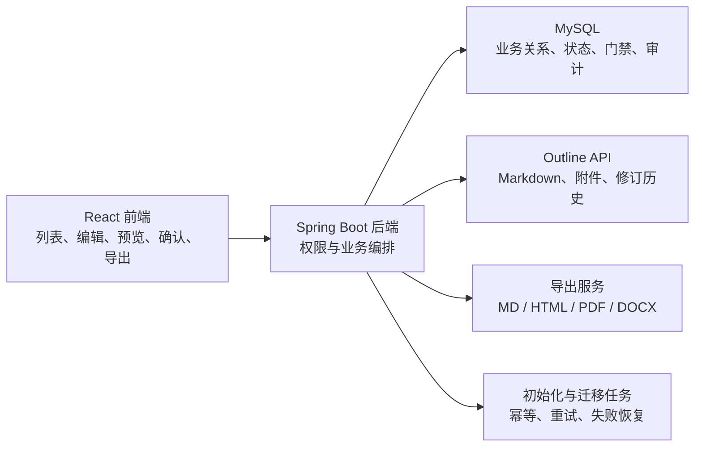

# Outline 统一文档中心设计

## 1. 背景与目标

当前系统分别使用知识条目正文、项目模板正文和文件附件承载文档信息，项目阶段推进与文档完成情况之间缺少统一关系。私有化 Outline 已部署在 `http://localhost:3000`，目标集合为“智鹿交付”，集合标识为 `D4rIACBrmU`。

本次改造将 Outline 作为全系统唯一的文档正文、附件和修订历史存储中心：

- 知识库拥有独立目录，包含最佳实践、代码片段、培训材料和文档模版。
- 每个项目拥有独立目录和七个阶段目录。
- 创建项目后自动从已发布模版生成阶段文档。
- 项目阶段推进通过必需文档的完成状态控制。
- 用户在本系统内预览、编辑和导出文档，也可跳转 Outline 查看协作与修订历史。
- 现有知识和项目数据迁移到 Outline。

本系统继续负责业务权限、项目关系、知识分类、模版配置、门禁状态和审计；Outline 负责 Markdown 正文、附件和修订版本。

## 2. 已确认的产品决策

- 使用专用 Outline 服务账号和 API Key，由后端统一调用 Outline API。
- 不自动收录集合内所有 Outline 文档，只有本系统创建或主动关联的文档进入业务数据。
- Outline 是所有知识和项目文档正文的唯一来源。
- 创建项目时自动创建项目目录、七个阶段目录和各阶段模版文档。
- 文档模版集中维护在知识库的“文档模版”目录。
- 模版配置适用阶段、必需或可选、启用状态和发布状态。
- 项目创建时复制当时的已发布模版；模版后续更新不覆盖已有项目文档。
- 必需文档由项目负责人手动确认完成。
- 确认后正文再次修改，完成状态自动失效为待确认。
- 首期支持 Markdown、HTML、PDF 和 Word 单篇导出。
- 系统内提供 Markdown 编辑与预览，同时保留“在 Outline 中打开”。
- Outline 不可用不阻断项目创建；系统自动重试，并支持手动重试。
- 现有项目和现有知识全部迁移到 Outline。

## 3. 总体架构



### 3.1 数据职责

Outline 保存：

- 文档标题和 Markdown 正文。
- 文档层级和排序。
- 文档附件。
- 文档修订历史和 Outline 侧协作信息。

MySQL 保存：

- Outline 集合、根目录和文档 ID 的业务映射。
- 知识类型、标签、产品和版本等元数据。
- 用于列表和搜索的标题、摘要及修订版本缓存；缓存由 Outline 同步更新，发生冲突时以 Outline 为准。
- 文档模版的适用阶段、必需性、启用和发布状态。
- 项目目录、阶段目录和项目文档映射。
- 项目文档状态、确认人、确认时间和确认时的 Outline 修订版本。
- 初始化、迁移和重试状态。
- 业务操作审计记录。

### 3.2 集成边界

- 浏览器不直接持有 Outline API Key。
- 前端只调用本系统 `/api/v1` 接口。
- 后端通过独立 `OutlineClient` 调用 Outline API。
- 禁止直接修改 Outline PostgreSQL 数据库，避免绕过权限、修订、事件和搜索索引。
- Outline API Key 通过环境变量或密钥管理系统提供，不写入代码或数据库明文。

## 4. Outline 目录模型

Outline 没有真实文件夹，目录使用可嵌套的索引文档表示。根集合结构如下：

```text
智鹿交付
├── 知识库
│   ├── 最佳实践
│   ├── 代码片段
│   ├── 培训材料
│   └── 文档模版
└── 项目文档
    └── PRJ-26001 华东银行财务中台
        ├── 01 项目启动
        ├── 02 需求采集
        ├── 03 二开实施
        ├── 04 上线切换
        ├── 05 试运行与移交
        ├── 06 标准化评估
        └── 07 项目收尾
```

每个索引文档保存简短说明，业务文档作为对应索引文档的子文档。

项目目录标题使用“项目编码 + 项目名称”。项目改名后可同步更新目录标题，但 Outline 文档 ID 保持不变。

## 5. 领域模型

### 5.1 Outline 文档映射

新增统一文档映射，至少包含：

- 业务文档 ID。
- 组织 ID。
- Outline 集合 ID。
- Outline 文档 ID 和 URL ID。
- 文档用途：知识、知识模版、项目目录、阶段目录、项目文档。
- 当前已知 Outline 修订版本和更新时间。
- 同步状态：待初始化、同步中、正常、失败。
- 最近错误和重试次数。

映射记录是本系统识别 Outline 文档的唯一依据，不通过标题猜测关系。

### 5.2 知识条目

保留现有知识条目的业务元数据：

- 类型：最佳实践、代码片段、培训材料、文档模版。
- 标签、产品、产品版本、可见范围、负责人和发布状态。
- Outline 文档映射。

标题与正文以 Outline 为准。现有 `content_text` 在迁移期间作为只读回退字段；迁移全部完成并稳定运行后再单独评估移除，不在本次直接删除。

知识列表需要的标题和摘要保留为本地查询缓存，创建、保存、迁移及后台同步都会刷新缓存。缓存不能作为文档编辑或导出的正文来源。

代码片段和培训材料的专属元数据继续保存在 MySQL；培训附件迁移到 Outline 文档附件后，旧文件关系保留用于回退和审计。

### 5.3 文档模版

“文档模版”是知识库第四种类型，并增加以下配置：

- 适用阶段。
- 必需或可选。
- 启用或停用。
- 草稿或已发布。
- Outline 源文档 ID。
- 发布时的 Outline 修订版本。

只有启用且已发布的模版参与项目初始化。发布动作记录当前 Outline 修订版本，保证项目复制的是明确版本。

### 5.4 项目文档

项目文档记录至少包含：

- 项目 ID 和阶段编码。
- 来源模版 ID及来源模版发布版本。
- Outline 文档映射。
- 必需或可选。
- 状态：待初始化、待填写、待确认、已完成、同步失败。
- 确认人、确认时间、确认时的 Outline 修订版本。
- 最近同步时间和错误信息。

项目文档是模版的独立副本，后续模版更新不会修改已经创建的项目文档。

## 6. 项目初始化流程

项目创建的数据库事务不依赖 Outline：

1. 创建项目、七阶段和项目成员。
2. 创建一条项目文档初始化任务，状态为待处理。
3. 提交项目事务并立即返回成功。
4. 后台任务调用 Outline API：
   - 确保“项目文档”根目录存在。
   - 创建或找到项目索引文档。
   - 创建七个阶段索引文档。
   - 查询所有启用且已发布的模版。
   - 将模版 Markdown 复制为对应阶段的项目文档。
   - 保存所有 Outline ID 和来源版本。
5. 全部完成后将项目文档空间状态更新为正常。

初始化必须幂等：

- 已存在映射时复用 Outline 文档。
- 每个项目、阶段和模版只生成一个有效映射。
- 重复执行不会创建重复目录或文档。

Outline 不可用时：

- 项目仍创建成功。
- 初始化任务记录失败原因并按退避策略重试。
- 项目页面显示“文档空间初始化失败”及手动重试操作。
- 达到自动重试上限后保留失败状态，不丢弃任务。

## 7. 编辑、预览与并发控制

### 7.1 系统内编辑

文档页面提供：

- Markdown 编辑模式。
- 渲染预览模式。
- 保存状态和最近同步时间。
- “在 Outline 中打开”链接。
- 导出菜单。

保存流程：

1. 前端提交 Outline 文档 ID、标题、Markdown 和编辑前修订版本。
2. 后端校验当前用户对知识或项目的业务权限。
3. 后端读取或比较 Outline 当前修订版本。
4. 版本一致时调用 Outline 更新接口。
5. 更新本地已知修订版本和同步时间。
6. 写入业务审计。

版本不一致时返回冲突，提示用户刷新后合并，不静默覆盖 Outline 中的最新内容。

### 7.2 文档状态

```text
待初始化 → 待填写 → 待确认 → 已完成
                         ↑         │
                         └─正文修改─┘
```

- Outline 文档尚未生成：待初始化。
- Markdown 为空或只有模版提示内容：待填写。
- 已填写但未由负责人确认：待确认。
- 项目负责人确认当前修订版本：已完成。
- 已完成文档的 Outline 修订版本变化后：自动回到待确认。

系统在读取文档详情、进入阶段页面和执行阶段门禁时比较修订版本，确保通过 Outline 页面直接编辑也能使旧确认失效。

## 8. 阶段门禁

阶段推进前，系统检查当前阶段所有必需项目文档：

- 文档必须成功初始化。
- 文档状态必须为已完成。
- 当前 Outline 修订版本必须与确认版本一致。

存在未完成文档时：

- `BLOCK` 模式：阻止推进，并列出未完成文档。
- `WARNING` 模式：允许用户确认后推进，活动记录中保存未完成文档清单。

可选文档不影响门禁，但在阶段页面单独展示完成情况。

阶段门禁的文档判断由后端完成，前端提示不作为安全边界。

## 9. 知识库体验

知识库保留现有卡片、筛选、草稿和发布流程，新增“文档模版”标签页及类型：

- 列表元数据由 MySQL 查询。
- 标题、摘要预览和正文从 Outline 获取。
- 搜索首期仍基于本系统元数据和同步的标题/摘要；全文搜索可调用 Outline 搜索接口。
- 创建知识时先创建本地草稿和 Outline 文档映射。
- 发布知识时确认 Outline 文档存在且正文有效。
- 文档模版额外展示适用阶段、必需性、启用状态和发布版本。

单个 Outline 文档只能绑定一个有效业务知识或项目文档，避免不同业务记录争用同一正文。

## 10. 导出

首期支持单篇文档导出：

- Markdown：输出 UTF-8 `.md` 原始正文。
- HTML：将 Markdown 渲染为包含基础排版样式的独立 HTML。
- PDF：基于渲染后的 HTML 生成适合归档和打印的 PDF。
- Word：将标题、段落、列表、表格、代码块和图片转换为 `.docx`。

所有导出接口：

- 先校验业务访问权限。
- 读取 Outline 最新内容。
- 设置安全的文件名和正确 MIME 类型。
- 失败时返回明确错误，不回退导出过期缓存。

首期不包含项目目录整包导出；后续可在单篇导出稳定后增加项目 ZIP。

## 11. 历史数据迁移

迁移分为两类任务。

### 11.1 现有知识迁移

1. 确保知识库及四种类型目录存在。
2. 为每条现有知识创建 Outline 文档。
3. 将标题、正文和现有附件写入 Outline。
4. 保存映射和迁移状态。
5. 校验 Outline 内容后标记迁移成功。

迁移成功前继续允许读取旧正文；成功后 Outline 成为唯一可编辑正文。

### 11.2 现有项目初始化

为所有现有项目执行与新项目相同的幂等初始化流程：

- 创建项目和七阶段目录。
- 根据当前已发布模版生成项目文档。
- 保存映射、来源版本和初始化结果。

迁移任务提供：

- 总数、成功数、失败数和待处理数。
- 单条失败原因。
- 手动重试。
- 可重复执行且不产生重复文档。

## 12. 权限与安全

- `knowledge:read`：查看知识文档和导出。
- `knowledge:write`：创建、编辑和发布知识及文档模版。
- 项目文档读取沿用项目访问范围。
- 项目文档编辑沿用项目成员和跨项目管理权限。
- 只有项目负责人或具有跨项目管理权限的用户可确认必需文档。
- Outline 服务账号仅授予目标集合需要的读写范围。
- API Key 不记录到日志、审计详情或浏览器响应。
- 所有 Outline 文档读写通过后端业务授权后执行。

## 13. 配置

新增后端配置：

- `OUTLINE_BASE_URL`
- `OUTLINE_API_TOKEN`
- `OUTLINE_COLLECTION_ID` 或稳定集合标识
- `OUTLINE_KNOWLEDGE_ROOT_DOCUMENT_ID`（初始化后可写入数据库）
- `OUTLINE_PROJECT_ROOT_DOCUMENT_ID`（初始化后可写入数据库）
- 初始化任务重试次数和退避间隔

系统管理页面展示 Outline 连通状态、集合信息、根目录状态和最近同步错误，但不展示 API Key。

当前 Outline 中已有 API Key 只保存哈希，无法恢复明文。实施联调前需要创建新的专用服务账号 API Key，并通过后端环境变量提供。

## 14. 错误处理与可观测性

- Outline 超时、鉴权失败、限流和服务异常使用不同错误码。
- 读取失败时页面显示同步错误和重试入口，不将空正文误认为真实内容。
- 写入失败时保留用户编辑内容并允许重试。
- 初始化和迁移任务保存尝试次数、最近错误和下次重试时间。
- 关键动作写入审计：创建文档、编辑、确认、取消确认、发布模版、导出、重试和迁移。
- 健康检查只报告 Outline 集成状态，不因 Outline 暂时不可用而使核心项目服务整体不健康。

## 15. 测试与验收

### 15.1 自动化测试

- Outline 客户端的请求、认证、超时和错误映射。
- 知识及模版创建、编辑、发布和类型筛选。
- 项目初始化幂等性和失败重试。
- 模版复制及来源版本固化。
- 文档确认、修订变化和完成状态失效。
- `BLOCK` 与 `WARNING` 两种门禁行为。
- 四种导出格式及权限隔离。
- 现有知识和项目迁移的幂等性。
- 组织隔离和 API Key 不泄露。

### 15.2 端到端验收

1. 在知识库创建并发布一个必需文档模版。
2. 创建项目，自动生成项目目录、七阶段目录和模版文档。
3. 在本系统编辑文档，并在 Outline 中看到相同 Markdown。
4. 确认文档后通过阶段门禁。
5. 在 Outline 中修改正文，回到系统后确认自动失效。
6. 分别导出 Markdown、HTML、PDF 和 Word。
7. 暂停 Outline 后创建项目，项目成功且文档初始化进入失败重试状态。
8. 恢复 Outline 后自动补建成功。
9. 执行历史迁移，重复运行不产生重复目录或文档。

## 16. 不在本次范围

- 项目所有文档整包 ZIP 导出。
- 实时多人协同编辑或 WebSocket 协同。
- 在本系统复制 Outline 的评论、收藏和完整修订历史界面。
- 自动覆盖已有项目文档的模版升级。
- 直接读写 Outline PostgreSQL。
- 将本系统用户自动同步为 Outline 用户。
