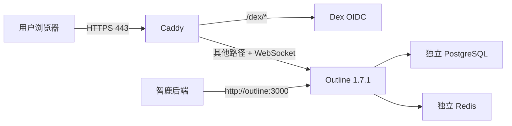

# Outline 阿里云部署与智鹿集成设计

## 1. 背景与目标

智鹿已经实现组织级 Outline 配置、连接测试、目录初始化，以及知识、项目、商机和产品文档的创建、读取、编辑、移动与导出能力，但阿里云环境尚未部署可用的 Outline 服务。

本次交付在现有阿里云 ECS `8.166.121.138` 上新增一套独立 Outline，并将已部署的智鹿系统接入。完成后应满足：

- 用户可通过 `https://outline.8.166.121.138.sslip.io` 安全访问 Outline。
- 使用独立管理员账号经 Dex OIDC 登录，不依赖第三方身份平台。
- 智鹿后端通过 Docker 内网调用 Outline，浏览器不接触 API Token。
- 初始化“智鹿交付文档中心”Collection 及智鹿所需根目录。
- 智鹿中的知识、项目、商机和产品文档能够完成真实创建、读取、编辑、导出和跳转。
- 新部署不得中断或改写现有 Rainier、智鹿服务。

## 2. 已确认的决策

- 采用独立轻量部署：Outline、PostgreSQL、Redis、Dex、Caddy 各自运行在专用 Compose 栈中。
- Outline 使用社区版固定版本镜像，不从源码构建。
- 认证使用 Dex 内置本地账号，首期只创建一个独立 Outline 管理员。
- 文件存储使用 Outline 本地存储卷，不复用智鹿 MinIO。
- PostgreSQL 和 Redis 独立运行，不复用智鹿数据库或缓存。
- Caddy 独占宿主机 443 端口并自动申请 TLS 证书；现有 Rainier 继续独占 80 端口。
- 智鹿后端通过共享 Docker 网络访问 Outline；用户浏览器通过公开 HTTPS 地址访问。
- 不修改智鹿业务代码，使用现有管理接口保存组织级连接配置。
- 为低配 ECS 增加 2 GiB Swap，并将 Outline `WEB_CONCURRENCY` 固定为 `1`。
- 部署、配置和验收失败时只回滚新增 Outline 栈，不影响已有容器。

## 3. 方案比较

### 3.1 采用：独立 Outline 栈 + Dex + Caddy

该方案边界清晰。Outline 的数据库、缓存、文件和身份数据可独立备份、恢复和升级；智鹿只依赖稳定的 Outline HTTP API。Caddy 通过 443 端口完成 TLS-ALPN-01 证书签发，不需要占用 Rainier 使用的 80 端口。Dex 内置账号避免引入 Keycloak 的资源成本。

代价是新增五个容器，但它们均使用预构建镜像，且 Outline 以单进程运行，适合当前 2 核、3.6 GiB 内存的 ECS。

### 3.2 不采用：复用智鹿 Redis、MinIO 和 Rainier Nginx

复用组件能减少容器数量，但会把 Outline 的升级、容量和故障域与智鹿绑定。修改 Rainier 镜像内的 Nginx 还会扩大现有生产入口的变更范围；MinIO 共域配置也容易导致认证 Header 和跨域问题。

### 3.3 不采用：Keycloak 认证

Keycloak 管理能力更强，但 JVM、数据库和管理面会显著增加内存及运维成本。当前只需要一个独立管理员账号，Dex 已覆盖所需 OIDC 能力。

## 4. 部署边界与组件

Outline 栈位于 ECS `/opt/outline-stack`，备份位于 `/opt/outline-backups`。所有镜像固定到以下版本，升级必须经过单独备份和验收：

| 组件 | 镜像 | 职责 |
| --- | --- | --- |
| Outline | `docker.getoutline.com/outlinewiki/outline:1.7.1` | 文档、目录、修订和 API |
| PostgreSQL | `postgres:18.4-alpine3.24` | Outline 业务数据库 |
| Redis | `redis:7.4.9-alpine3.21` | Outline 缓存、任务和协作状态 |
| Dex | `ghcr.io/dexidp/dex:v2.45.1-alpine` | 本地账号和 OIDC 服务；Alpine 变体提供容器内健康检查工具 |
| Caddy | `caddy:2.11.4-alpine` | 公网 HTTPS、WebSocket 和反向代理 |

Compose 栈使用具名卷持久化：

- PostgreSQL 数据。
- Redis AOF/RDB 数据。
- Outline `/var/lib/outline/data` 文件。
- Dex SQLite 数据。
- Caddy 证书和状态数据。

PostgreSQL、Redis、Dex 和 Outline 不映射宿主机端口。Caddy 只映射 `443/tcp` 和 `443/udp`。现有 Rainier、智鹿 Compose 文件、镜像和容器不在本次修改范围内。

## 5. 网络与请求路由



Outline 栈建立私有网络 `outline-stack_private`。Outline 服务同时加入现有外部网络 `zhilu-delivery_default`，并使用网络别名 `outline`。因此：

- 智鹿后端服务地址为 `http://outline:3000`。
- 浏览器公开地址为 `https://outline.8.166.121.138.sslip.io`。
- Dex issuer 为 `https://outline.8.166.121.138.sslip.io/dex`。
- Outline OIDC 回调为 `https://outline.8.166.121.138.sslip.io/auth/oidc.callback`。

Caddy 保留 `/dex/*` 原始路径转发给 Dex，其他请求转发给 Outline。Caddy 原生反向代理 WebSocket，满足 Outline 实时编辑要求。证书申请依赖：

- `outline.8.166.121.138.sslip.io` 解析到 `8.166.121.138`。
- 阿里云安全组和主机防火墙允许公网访问 443 TCP；443 UDP 用于 HTTP/3，可用性不作为上线硬门槛。
- 80 端口继续由 Rainier 使用，Caddy 不映射 80，证书签发使用 443 上的 TLS-ALPN-01。

如果公网 443 被阿里云安全组阻止，停止上线配置，保留已创建的数据卷，并明确列出需要在控制台放行的规则；不得占用或重启 Rainier 的 80 端口作为替代。

## 6. 身份、密钥与权限

### 6.1 Dex 管理员

Dex 启用内置密码数据库，静态管理员邮箱固定为 `outline-admin@zhilu.local`，显示名为“Outline 管理员”。部署时生成不少于 24 个随机字符的密码，仅将 bcrypt 哈希写入 Dex 配置；明文密码在交付时单独提供，不写入仓库或服务器日志。

Dex 为 Outline 配置一个私有 OIDC client。Client Secret、Dex 用户 UUID 和签名状态均由部署过程生成并持久化。首次通过 Dex 登录 Outline 的用户创建工作区并成为管理员。

### 6.2 Outline 密钥

部署时分别生成：

- 32 字节十六进制 `SECRET_KEY`。
- 独立高强度 `UTILS_SECRET`。
- PostgreSQL 密码。
- Redis 密码。
- Dex OIDC Client Secret。

密钥文件由 root 持有，目录权限为 `0700`，文件权限为 `0600`。不得在 Git、Compose 明文、命令历史、日志或验收响应中输出密钥。`SECRET_KEY` 丢失会破坏 Outline 已加密数据，因此它必须纳入初始灾备包和每日备份，且不得在普通重启或升级时重新生成。

### 6.3 智鹿 API Token

在 Outline 中由管理员创建专用 API Token，并设置有效期为长期、权限严格限制为：

```text
collections.info
documents.create
documents.info
documents.list
documents.update
documents.move
documents.export
```

Token 只提交给智鹿后端现有配置接口。智鹿使用 `SETTINGS_ENCRYPTION_KEY` 加密后按组织存储；配置读取接口只返回“已配置”，不返回 Token 明文。

## 7. 部署与集成流程

### 7.1 前置保护

1. 记录现有 Rainier 和智鹿容器、网络、镜像、端口和健康状态。
2. 备份智鹿 MySQL，验证备份文件非空并可读取元数据。
3. 检查 ECS 磁盘、内存和 Docker 可回收空间。
4. 若尚无 Swap，则创建 2 GiB Swap 文件并写入 `/etc/fstab`；已有同等或更大 Swap 时不重复创建。
5. 检查 443 端口未被占用，不停止或重启现有服务。

### 7.2 启动 Outline 栈

1. 创建 `/opt/outline-stack`、私密环境文件、Dex 配置、Caddy 配置和 Compose 文件。
2. 先拉取所有固定版本镜像，避免启动过程中混合下载和资源竞争。
3. 依次启动 PostgreSQL、Redis、Dex、Outline、Caddy；每一步等待健康检查通过。
4. 确认 Outline 自动数据库迁移完成且没有重启循环。
5. 从 ECS 本机和外部客户端分别验证 HTTPS、OIDC discovery 和 Outline 页面。

### 7.3 初始化 Outline

1. 使用 Dex 管理员首次登录 Outline。
2. 创建工作区和 Collection，Collection 名称固定为“智鹿交付文档中心”。
3. 创建具有第 6.3 节最小权限的专用 API Token。
4. 通过 `collections.info` 获取 Collection 规范 UUID，并用 Token 验证访问。

### 7.4 配置智鹿

使用当前组织的智鹿管理员会话调用现有接口：

1. `POST /api/v1/admin/document-center/config/test`，提交内网服务地址、公开地址、Token 和 Collection UUID。
2. 只有测试返回 `READY` 后才调用 `PUT /api/v1/admin/document-center/config`。
3. 读取 `GET /api/v1/admin/document-center/config`，确认来源为 `ORGANIZATION` 且 `apiTokenConfigured=true`。
4. 调用 `POST /api/v1/admin/document-center/initialize` 初始化知识库和项目文档根目录。
5. 调用 `POST /api/v1/admin/document-center/initialize-products` 初始化产品文档目录。

保存前的连接测试失败时，不修改智鹿已有组织配置。目录初始化失败时保留已成功创建的 Outline 文档和映射，依赖现有幂等初始化接口重试，不手工删除部分目录。

## 8. 数据流

### 8.1 用户登录与协作

1. 用户访问公开 HTTPS 地址。
2. Outline 将登录请求重定向到同域 `/dex`。
3. Dex 校验本地管理员账号并向 Outline 返回 OIDC claims。
4. Outline 创建会话；文档页面和实时编辑 WebSocket 均经 Caddy 转发。

### 8.2 智鹿文档操作

1. 浏览器只向智鹿 `/api/v1` 提交业务请求。
2. 智鹿根据当前组织读取加密 Outline 配置并构造连接快照。
3. 智鹿后端携带 Bearer Token，通过 `http://outline:3000/api/...` 调用 Outline。
4. Outline 将正文、目录和修订写入独立 PostgreSQL，将附件写入本地持久卷。
5. 智鹿只保存业务关系、状态及 Outline 文档 ID；返回给前端的跳转地址使用公开 HTTPS Base URL。

该路径不依赖公网回环，Outline 公网入口故障时，智鹿后端仍可通过 Docker 内网调用；用户跳转和 Outline 页面协作则依赖 Caddy 与 HTTPS 正常。

## 9. 资源控制与运行策略

- Outline 固定 `WEB_CONCURRENCY=1`，不启用水平扩容或独立 collaboration 集群。
- 所有服务配置 `restart: unless-stopped` 和健康检查；依赖服务健康后才启动上层服务。
- 容器内存上限固定为：Outline 768 MiB、PostgreSQL 384 MiB、Redis 128 MiB、Dex 128 MiB、Caddy 128 MiB。单个服务达到上限时由该服务失败并按重启策略恢复，不能无限占用主机内存。
- Redis 开启持久化，但 Redis 数据不作为 Outline 业务事实源；恢复时优先恢复 PostgreSQL 和文件卷。
- 不在 ECS 上构建 Outline、Dex 或 Caddy 镜像。
- 启动后观察不少于 10 分钟的容器重启数、内存、Swap 和错误日志，再进行业务初始化。
- 观察期间宿主机不得出现 OOM；Swap 持续占用不得超过 1.5 GiB。超过任一阈值即停止业务初始化并按第 11 节回滚新增栈。

## 10. 备份与恢复

### 10.1 备份策略

首次验收前创建完整备份，之后每天北京时间 03:30 执行：

- `pg_dump` 导出 Outline PostgreSQL，并以 gzip 压缩。
- 打包 Outline 文件存储卷。
- 备份 Dex SQLite、Dex 配置、Caddy 数据和 Outline 密钥文件。
- 生成 SHA-256 校验清单。

备份保存在 `/opt/outline-backups/YYYY-MM-DD`，目录仅 root 可读，保留最近 7 个每日备份。首次部署还要生成包含关键密钥的加密灾备包并下载到用户本机；解密口令与管理员密码分开交付。单机每日备份用于误操作恢复，加密灾备包用于服务器磁盘丢失后的密钥恢复。

### 10.2 恢复顺序

1. 停止 Outline 和 Dex 写入流量，不删除卷。
2. 恢复密钥文件，确保 `SECRET_KEY` 与备份一致。
3. 恢复 PostgreSQL。
4. 恢复 Outline 文件卷和 Dex SQLite。
5. 启动 Redis、PostgreSQL、Dex、Outline、Caddy。
6. 验证 OIDC 登录、Collection、文档附件和智鹿 API。

恢复演练首期以备份清单、压缩包可读性和 PostgreSQL dump 元数据校验为准；在生产实例上执行破坏性恢复不属于本次验收范围。

## 11. 失败处理与回滚

- 镜像下载或容器启动失败：停止新增 Compose 栈，保留配置和数据卷以便诊断；不触碰现有容器。
- TLS 签发失败：检查解析、443 安全组和时间同步；不抢占 80 端口，不降级为长期 HTTP。
- Dex 登录失败：保持 Outline 未初始化状态，修复 issuer、redirect URI 或 client secret 后重试；不改用无认证入口。
- Outline 迁移失败：停止 Outline，保留数据库，使用启动前备份恢复；不得直接修改 Outline 数据库表绕过迁移。
- 智鹿连接测试失败：不保存配置，记录脱敏错误并继续保持旧配置。
- 智鹿初始化部分失败：通过幂等接口重试，不删除成功文档，不回滚业务数据库。
- ECS 内存压力过高：先停止新增 Outline 栈并恢复原服务资源，不停止 Rainier 或智鹿；重新评估内存上限或升级实例规格。
- 全量回滚：执行 `docker compose down`，不加 `--volumes`；移除 Outline 与智鹿共享网络连接即可恢复部署前状态。

任何回滚都不得删除 `/opt/outline-stack`、持久卷或 `/opt/outline-backups`，除非已确认完整备份且用户另行授权。

## 12. 验收标准

以下项目全部通过才算完成：

### 12.1 基础设施

- 域名解析到 `8.166.121.138`。
- HTTPS 证书有效，无浏览器安全告警，HTTP/2 可用。
- Outline、PostgreSQL、Redis、Dex、Caddy 均无重启循环且健康检查通过。
- 运行观察期间无 OOM，现有 Rainier 3 个容器和智鹿 6 个容器保持健康。

### 12.2 身份与 Outline

- 独立管理员可通过 Dex 登录、退出并再次登录。
- “智鹿交付文档中心”Collection 存在。
- 最小权限 API Token 可调用第 6.3 节所有接口，其他未授权接口不作为智鹿依赖。
- 创建和编辑文档时 WebSocket 正常，刷新后内容仍存在。

### 12.3 智鹿集成

- 配置测试返回 `READY`。
- 配置读取返回组织级来源、正确公开地址和已配置 Token 状态，且不回显 Token。
- 知识库、项目文档和产品文档初始化接口成功。
- 至少执行一条真实文档的创建、读取、编辑和导出。
- 智鹿返回的 `outlineUrl` 能打开正确的公开 Outline 文档。
- 知识、项目、商机或产品页面至少完成一条端到端业务烟测。

### 12.4 运维交付

- 初始完整备份存在且 SHA-256 校验通过。
- 每日备份任务已安装，保留策略可验证。
- 加密灾备包已下载到用户本机。
- 管理员账号、公开 URL、备份位置和恢复要点完成交付。

## 13. 非目标

本次不包含：

- 智鹿账号与 Dex 用户同步或单点登录。
- 多用户、自助注册、邮件邀请和密码找回。
- Keycloak、LDAP、企业微信或钉钉身份集成。
- Outline 高可用、跨主机部署或对象存储迁移。
- 修改 Rainier 网关、智鹿业务代码或现有数据库结构。
- 为 Outline 启用付费版 AI、SAML 或其他企业功能。
- 自动升级到未来 Outline 版本。

后续需要新增用户或接入企业身份源时，应作为独立变更设计，不在本次部署中提前引入。

## 14. 官方依据

- [Outline Docker 部署](https://docs.getoutline.com/s/hosting/doc/docker-7pfeLP5a8t)
- [Outline OIDC 配置](https://docs.getoutline.com/s/hosting/doc/oidc-8CPBm6uC0I)
- [Outline API 与 Token scope](https://docs.getoutline.com/s/guide/doc/api-1rEIXDfLF6)
- [Outline 文件存储](https://docs.getoutline.com/s/125de1cc-9ff6-424b-8415-0d58c809a40f)
- [Outline 故障排查](https://docs.getoutline.com/s/hosting/doc/troubleshooting-HXckrzCqDJ)
- [Dex 容器和配置](https://dexidp.io/docs/getting-started/)
- [Dex 本地账号](https://dexidp.io/docs/connectors/local/)
