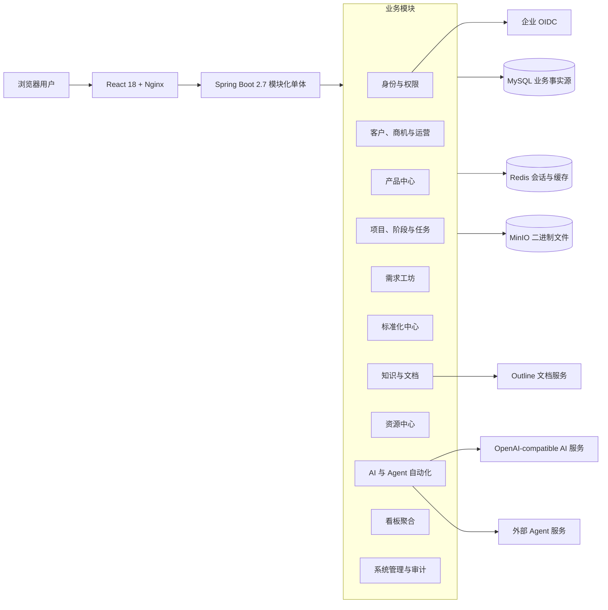
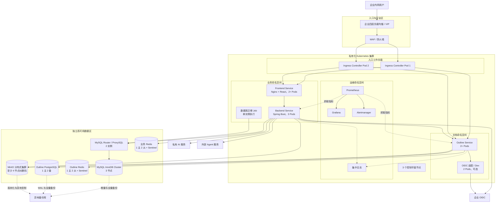

# 智鹿交付项目管理平台系统设计文档

> 文档类型：生产高可用目标架构技术评审稿
>
> 版本：1.0
>
> 日期：2026-07-28
>
> 适用范围：私有化 Kubernetes 生产环境
>
> 容量基线：不超过 100 名用户、500 个项目、约 1 TB 附件
>
> 设计依据：`main` 分支提交 `a25e786`、现有源码、数据库迁移、Compose 配置及运维文档

## 1. 文档目的

本文档定义智鹿交付项目管理平台面向正式生产环境的目标系统架构，供架构、研发、测试、安全和运维团队进行技术评审。

文档重点回答以下问题：

- 系统各模块如何划分，数据由谁负责；
- 现有模块化单体如何安全运行多个实例；
- 私有化 Kubernetes 环境中如何消除关键单点；
- 外部 AI、Agent、Outline 或基础设施故障时如何降级和恢复；
- 如何验证高可用、安全、性能和容灾目标。

本文描述目标生产架构，不表示仓库当前的 Docker Compose 部署已经具备同等级别的高可用能力。

## 2. 系统概述

智鹿交付项目管理平台面向企业软件交付团队，将客户、商机、项目、需求、任务、文档、Agent 自动化、标准化、知识沉淀和资源调度纳入一条可审计链路。

### 2.1 核心业务能力

- 总控看板：KPI、项目状态、风险热力、产品项目矩阵和快速启动；
- 客户中心：客户主数据、五阶段商机、实施协同、回款维保和持续运营；
- 项目空间：七阶段生命周期、门禁、任务、风险、里程碑和项目文档；
- 需求工坊：需求采集、AI 建议、人工 L0/L1/L2 决策、查重和二开任务；
- 标准化中心：能力基线、成熟度、偏离度、标准化债务和成本归集；
- 知识与文档：知识条目、项目文档、Outline 修订和多格式导出；
- 资源中心：人员档案、技能矩阵、排期、负载和冲突预警；
- 系统管理：用户、团队、角色权限、运行参数和审计日志。

### 2.2 设计目标

| 维度 | 目标 |
|---|---|
| 架构 | 保持模块化单体，模块边界清晰，可独立演进 |
| 可用性 | 应用服务目标可用性 99.9%，单个 Pod、工作节点或数据节点故障不导致整体服务中断 |
| 性能 | 普通查询 P95 不超过 1 秒，普通写操作 P95 不超过 2 秒 |
| 扩展性 | 无状态应用通过副本数和 HPA 横向扩展，不进行业务分库分表 |
| 容灾 | RPO 不超过 15 分钟，RTO 不超过 2 小时 |
| 安全 | 企业 OIDC、RBAC、项目数据范围、全链路 TLS、密钥集中管理和审计 |
| 可运维 | 指标、日志、告警、备份、恢复和发布流程可观测、可演练 |

### 2.3 非目标

- 不拆分为微服务；
- 不建设跨机房双活；
- 不引入分布式事务、消息队列或 BPMN 工作流引擎；
- 不承诺 AI、Agent 或 Outline 故障时相关增强能力继续可用；
- 不建设 SaaS 多租户和字段级权限系统；
- 不为当前容量提前实施 MySQL 分库分表或缓存集群分片。

## 3. 架构原则与关键决策

### 3.1 模块化单体优先

当前容量和团队规模不足以抵消微服务带来的网络调用、分布式一致性、部署单元和运维复杂度。后端继续作为一个 Spring Boot 部署单元，按业务能力分包并明确数据所有权。

模块之间的写操作必须通过应用服务完成，禁止跨模块直接更新数据表。驾驶舱等聚合模块可以只读访问其他模块数据。

### 3.2 无状态应用上 Kubernetes，状态数据独立高可用

React/Nginx、Spring Boot、Outline 和接入适配组件运行在 Kubernetes。MySQL、Redis、MinIO 和 Outline PostgreSQL 部署在独立数据节点或企业已有的等价高可用基础设施中。

该方式将应用故障域与数据故障域分离，避免 Kubernetes 集群或存储类故障同时影响应用和业务数据。

### 3.3 事实源明确

| 数据类型 | 事实源 | 说明 |
|---|---|---|
| 项目、客户、需求、权限、任务和审计 | MySQL | 唯一业务事实源 |
| 文档正文、目录和修订 | Outline / PostgreSQL | MySQL 只保存业务关联、同步状态和确认修订 |
| PDF、Word、课件及其他二进制文件 | MinIO | MySQL 保存对象元数据和业务关联 |
| 会话、短期缓存和可重建临时状态 | Redis | Redis 不保存唯一业务事实 |
| AI 建议 | MySQL 中的建议记录 | 未经人工确认不得成为正式分类结论 |

### 3.4 外部调用最终一致

对 Outline、AI 和 Agent 的调用不参与本地数据库事务。统一采用“本地落库、异步调用、状态回写、失败重试、人工补偿”的方式，避免远程故障阻塞核心事务。

## 4. 总体逻辑架构



### 4.1 前端

- React 18、TypeScript、Vite 和 Ant Design；
- TanStack Query 管理服务端状态；
- Nginx 提供静态资源和 `/api` 同源反向代理；
- 前端只负责交互级权限提示，后端始终作为最终授权边界；
- 所有关键页面必须具备加载、空数据、错误、无权限和降级状态。

### 4.2 后端

- Java 8、Spring Boot 2.7、Spring Security、Spring Data JPA；
- REST API，Redis Session 支持后端实例无状态化；
- Flyway 管理数据库结构；
- 统一 API 错误格式、追踪 ID、字段校验和审计；
- AI、Agent、Outline 和 MinIO 通过适配器隔离外部实现。

### 4.3 数据与文档

- MySQL 保存强一致业务数据；
- Redis 保存会话及可丢失状态；
- MinIO 保存版本化二进制对象；
- Outline 保存可编辑文档正文和修订；
- Outline 使用独立 PostgreSQL，不与业务 MySQL 混用；
- 业务 Redis 与 Outline Redis 逻辑隔离，避免键空间、权限和容量相互影响。

## 5. 后端模块边界

| 模块 | 主要职责 | 主要依赖 |
|---|---|---|
| `iam` | 本地登录、OIDC、用户、团队、角色、权限和身份映射 | Redis Session、OIDC |
| `customer` | 客户主数据及客户视图 | `iam` |
| `opportunity` | 五阶段商机、售前门禁、调研报告和阶段文档 | `customer`、`catalog`、`document` |
| `operation` | 实施协同、回款维保、持续运营和复购 | `customer`、`project` |
| `catalog` | 产品、版本、产品结构、能力基线、产品文档和负责人 | `iam`、`document` |
| `project` | 项目、七阶段、门禁、成员、风险、里程碑和设置 | `iam`、`catalog`、`resource` |
| `task` | 项目任务、关联对象、状态和提醒 | `project`、`iam` |
| `requirement` | 需求、AI 分类建议、人工决策、查重和二开任务 | `project`、`catalog`、`automation` |
| `standardization` | 成熟度、偏离度、标准化债务、成本和产品回流 | `requirement`、`catalog` |
| `knowledge` | 知识条目、最佳实践、代码片段和培训材料 | `catalog`、`storage`、`document` |
| `document` | Outline 目录、修订、同步任务、项目文档和导出 | Outline、`storage` |
| `resource` | 人员档案、技能、排期、负载和资源冲突 | `iam`、`project` |
| `automation` | AI Client、Agent Job、回调、幂等、重试和超时 | AI、Agent、`storage` |
| `storage` | MinIO 对象、文件元数据、版本和下载授权 | MinIO、`iam` |
| `dashboard` | KPI 和跨模块只读聚合 | 只读访问业务数据 |
| `admin` / `audit` | 运行设置、密钥密文、管理操作和审计日志 | 所有写模块 |

## 6. 核心领域与状态机

### 6.1 项目生命周期

项目包含以下七个阶段：

1. 启动；
2. 需求采集；
3. 二开实施；
4. 上线切换；
5. 试运行与移交；
6. 标准化评估；
7. 项目收尾。

项目状态为：

```text
DRAFT → ACTIVE → SUSPENDED → CLOSING → CLOSED
```

阶段状态为：

```text
PENDING → ACTIVE → COMPLETED
                   ↘ BLOCKED
```

阶段门禁支持警告和阻断。状态转换必须在后端校验，前端不得通过跳过页面校验绕过门禁。

### 6.2 需求分类

AI 输出 L0/L1/L2 建议、置信度和理由，但只有人工确认或带理由改判后，分类结论才能进入项目漏斗、成本统计和标准化分析。

L1 需求可生成二开任务。同一产品或版本下的高频 L1 模式形成标准化债务候选，由有权限的人员确认后进入债务生命周期。

### 6.3 异步任务

Agent Job 采用以下状态：

```text
QUEUED → RUNNING → SUCCEEDED
            ├────→ FAILED
            ├────→ TIMED_OUT
            └────→ CANCELLED
```

Outline 文档任务使用明确的待处理、处理中、成功、失败和可重试状态。任务状态必须持久化，不能只保存在进程内存。

## 7. 关键数据流

### 7.1 创建项目

1. 用户提交客户、产品、版本、负责人和计划信息；
2. 后端在单个 MySQL 事务中创建项目、七阶段、初始成员和门禁实例；
3. 事务提交后创建 Outline 空间初始化任务和 Agent 初始化任务；
4. 后台工作器通过带条件的状态更新认领任务；
5. Outline 或 Agent 返回结果后更新本地状态及业务关联；
6. 外部服务失败时保留项目，并显示待初始化或失败状态；
7. 系统有限重试后转为人工重试，不无限占用工作器。

### 7.2 需求分类与标准化回流

1. 用户录入需求并关联项目；
2. AI 根据需求、产品能力和历史记录给出分类建议；
3. 后端校验 AI 结构化结果并保存为建议，不直接覆盖业务结论；
4. 工程师确认或说明原因后改判；
5. L1 结论生成二开任务，并参与相似需求和标准化债务统计；
6. 产品经理将已确认债务转为产品特性，完整记录来源和审计链路。

### 7.3 文档创建与修订确认

1. MySQL 保存文档业务归属、目标目录、同步状态和模板快照；
2. 后台任务调用 Outline 创建或复制文档；
3. Outline 返回文档 ID 和修订号后，后端写回业务关联；
4. 编辑行为在 Outline 中完成，确认时后端读取当前修订并记录；
5. 导出任务按确认修订生成 Markdown、HTML、PDF 或 Word；
6. Outline 不可用时，业务记录保持可访问，文档功能显示降级状态并允许稍后重试。

### 7.4 Agent 异步执行

1. 前端发起任务，后端先保存本地 `AgentJob`；
2. 调度器认领任务并调用外部 Agent；
3. Agent 回调包含 `eventId`、外部任务 ID、时间戳、状态和产出物；
4. 后端验证 HMAC-SHA256、时间窗和事件幂等性；
5. 产出物先写入 MinIO，再在 MySQL 中绑定业务元数据；
6. 前端轮询本系统状态，不直接依赖外部 Agent；
7. 超时扫描和状态对账保证任务最终收敛。

## 8. 一致性、幂等与错误处理

### 8.1 一致性边界

| 场景 | 一致性 |
|---|---|
| 项目、权限、阶段门禁、人工分类 | MySQL 事务内强一致 |
| 文件元数据和业务关联 | MySQL 事务内强一致 |
| MinIO 对象与 MySQL 元数据 | 最终一致，失败后清理孤儿对象 |
| Outline 文档与业务关联 | 最终一致，可重试、可人工修复 |
| Agent 状态和产出物 | 最终一致，通过回调和主动对账收敛 |
| 看板统计 | 允许短暂延迟 |

### 8.2 多副本任务认领

当前后端包含多个 `@Scheduled` 扫描任务。生产环境运行 3 个后端 Pod 时，必须满足以下要求：

- 任务表包含状态、认领实例、租约截止时间、尝试次数和下次执行时间；
- 认领使用原子条件更新或 `SELECT ... FOR UPDATE SKIP LOCKED`；
- 同一任务在同一时刻只能由一个 Pod 持有有效租约；
- 工作器周期续租，Pod 异常退出后其他实例可在租约到期后接管；
- 外部调用仍使用业务幂等键，防止租约边界导致重复副作用；
- 全局扫描任务使用数据库锁或等价分布式锁，不能依赖单实例假设。

在这些条件完成验证前，不得仅通过增加后端副本宣称已实现应用高可用。

### 8.3 错误处理

- API 统一返回错误码、用户消息、追踪 ID 和字段错误，不返回堆栈；
- 可编辑聚合使用乐观锁，版本冲突返回 HTTP 409；
- 外部调用设置连接、读取和总时限；
- 仅对网络错误、超时、限流和 5xx 进行有限指数退避；
- 业务 4xx 不自动重试；
- 连续失败达到阈值后暂停自动重试并告警；
- 用户界面展示“处理中、失败、可重试、需管理员处理”等明确状态；
- AI、Agent 或 Outline 故障不得阻断核心项目和需求管理。

## 9. 生产高可用部署架构

### 9.1 部署架构图



### 9.2 Kubernetes 基础要求

- 3 个控制平面节点，至少 3 个工作节点；
- 节点分布在不同物理宿主机、机柜或等价故障域；
- 控制平面、etcd 和工作负载网络均启用 TLS；
- 使用受支持的 CNI、CSI 和 Ingress Controller；
- 前端、后端、Outline 和 Ingress 配置反亲和，避免同类副本落在同一工作节点；
- 关键工作负载配置 `PodDisruptionBudget`；
- 使用 `startupProbe`、`readinessProbe` 和 `livenessProbe`，避免启动迁移期间过早接流量；
- 使用 `NetworkPolicy` 限制命名空间和服务间访问；
- 镜像从私有镜像仓库拉取，并按不可变摘要发布；
- 集群时间统一通过 NTP 同步，保证审计和 HMAC 时间窗可靠。

### 9.3 工作负载建议

| 工作负载 | 初始副本 | 单 Pod 建议请求 | 说明 |
|---|---:|---|---|
| Ingress Controller | 2 | 0.25 CPU / 256 MiB | 跨节点部署 |
| Frontend | 2 | 0.1 CPU / 128 MiB | 静态资源，按连接和 CPU 扩展 |
| Backend | 3 | 0.5 CPU / 1 GiB | Java 堆初始建议 512–768 MiB |
| Outline | 2 | 0.5 CPU / 1 GiB | 会话和任务状态必须外置 |
| Dex（如使用） | 2 | 0.1 CPU / 128 MiB | 企业 OIDC 已满足需求时可省略 |

以上是容量基线下的起点，不是硬性上限。上线前根据压测结果调整 `requests`、`limits`、JVM 堆和连接池。

### 9.4 基础设施起始规格

| 节点角色 | 数量 | 单节点建议起始规格 | 存储与部署要求 |
|---|---:|---|---|
| Kubernetes 控制平面 | 3 | 4 CPU / 8 GiB | 100 GiB 系统盘，跨物理故障域 |
| Kubernetes 工作节点 | 3 | 8 CPU / 16 GiB | 200 GiB 系统及镜像盘，跨物理故障域 |
| MySQL 数据节点 | 3 | 8 CPU / 16 GiB | 500 GiB 企业级 SSD，独立数据盘 |
| MySQL Router / ProxySQL | 2 | 2 CPU / 4 GiB | 可与独立接入节点合并，但不能单实例 |
| Redis 数据节点 | 3 | 2 CPU / 4 GiB | 100 GiB SSD；业务与 Outline 使用独立实例或严格资源隔离 |
| PostgreSQL 数据节点 | 3 | 4 CPU / 8 GiB | 300 GiB 企业级 SSD，独立 WAL 与备份链路 |
| MinIO 数据节点 | 4 | 4 CPU / 8 GiB | 每节点至少 2 TiB 可用数据盘，万兆网络优先 |

这些规格用于形成压测和容量评审的共同起点，不替代基于真实附件增长率、数据库大小和企业基础设施性能的最终选型。允许复用企业已有高可用数据库、Redis 或对象存储，但不得降低副本、故障域、备份和恢复指标。

### 9.5 数据层

#### MySQL

- 3 节点 InnoDB Cluster/MGR，跨故障域部署；
- 2 个 MySQL Router 或 ProxySQL 实例提供统一访问地址；
- 开启 GTID、binlog、慢查询日志和严格 SQL 模式；
- 业务账号使用最小权限，迁移账号与运行账号分离；
- 连接池总量必须小于数据库安全连接上限，并为运维和故障转移预留容量。

#### Redis

- 业务 Redis 使用 1 主 2 从和 3 个 Sentinel；
- Outline Redis 使用独立逻辑实例，建议同样采用 1 主 2 从；
- 开启认证、ACL 和 TLS；
- Redis 故障允许会话失效，但不得造成业务事实丢失；
- 不使用 Redis 保存唯一任务状态、唯一锁信息或不可重建业务数据。

#### PostgreSQL

- Outline PostgreSQL 使用 1 主 2 备；
- 使用 Patroni、repmgr 或企业现有 PostgreSQL 高可用方案进行自动故障转移；
- 启用 WAL 归档和时间点恢复；
- Outline 连接通过稳定代理或虚拟地址访问当前主节点。

#### MinIO

- 至少 4 个独立节点，并使用多磁盘纠删码；
- 启用版本控制、服务端加密、TLS 和对象锁定策略；
- 业务后端与 Outline 使用独立 Bucket、账号和最小权限策略；
- 容量告警阈值设置为 70%、80% 和 90%；
- 对象存储备份必须与 MySQL、PostgreSQL 的一致性恢复点共同演练。

## 10. 网络与安全设计

### 10.1 网络分区

- 入口区只开放 HTTPS；
- Kubernetes 应用区只允许经 Ingress 或受控管理网络访问；
- 数据区仅接受指定应用命名空间或节点网段访问；
- MySQL、PostgreSQL、Redis 和 MinIO 管理端口不得对普通办公网开放；
- AI、Agent、OIDC 出站访问采用目标白名单；
- 备份网络与业务访问网络分离。

### 10.2 身份与授权

- 企业 OIDC 作为主登录方式；
- 本地管理员仅用于身份系统故障时的应急访问；
- 角色权限与项目数据范围共同决定授权结果；
- 管理员、PMO、交付负责人、交付工程师、技术经理和产品经理采用最小权限；
- 用户禁用、角色变更和会话撤销应在短时间内对所有后端实例生效；
- 生产环境必须关闭或限制 Swagger、调试接口和演示账号。

### 10.3 Web 与接口安全

- 全链路 HTTPS，Cookie 设置 `HttpOnly`、`Secure` 和合适的 `SameSite`；
- 状态变更接口启用 CSRF 保护；
- OIDC 回调、Agent 回调和文件下载使用独立校验；
- Agent 回调采用 HMAC-SHA256、5 分钟时间窗和事件幂等；
- 文件上传校验大小、扩展名、MIME、对象 Key 和恶意内容；
- WAF 或 Ingress 对登录、导出和高成本接口进行限流；
- 错误响应不泄露堆栈、密钥、数据库结构或内部地址。

### 10.4 密钥管理

- 数据库密码、OIDC Secret、Agent 共享密钥、AI API Key、MinIO Secret 和加密主密钥不得进入 Git；
- 优先使用企业 Secret Manager；最低要求为 Kubernetes Secret 配合静态加密和严格 RBAC；
- `SETTINGS_ENCRYPTION_KEY` 必须稳定保存并纳入灾备；
- 密钥轮换采用双密钥或明确迁移流程，不能直接替换导致历史密文不可解密；
- 访问密钥的读取、使用和轮换行为进入安全审计。

## 11. 高可用与故障处理

| 故障 | 预期行为 | 恢复方式 |
|---|---|---|
| 单个前端 Pod 故障 | Service 将流量转移到其他副本 | Kubernetes 自动重建 |
| 单个后端 Pod 故障 | Redis Session 保持登录，未完成任务由租约接管 | Kubernetes 自动重建，后台任务重新认领 |
| 单个工作节点故障 | 关键 Pod 在其他节点重新调度 | 节点修复后重新加入 |
| MySQL 主节点故障 | MGR 选主，Router 转发到新主 | 自动切换，应用连接池重连 |
| Redis 主节点故障 | Sentinel 提升从节点 | 会话可能短暂重试，业务数据不丢失 |
| PostgreSQL 主节点故障 | HA 管理器提升备用节点 | Outline 重连后恢复 |
| 单个 MinIO 节点故障 | 纠删码继续提供对象读写 | 修复节点并执行愈合 |
| AI 不可用 | 分类建议不可用，人工分类继续 | 熔断后探测恢复 |
| Agent 不可用 | 新任务排队或失败，核心项目流程继续 | 退避重试或人工重试 |
| Outline 不可用 | 文档预览和编辑降级，项目业务继续 | 后台任务恢复后补偿 |
| Kubernetes 集群整体故障 | 当前机房服务不可用 | 按备份在备用环境恢复，不承诺双活 |

## 12. 备份与容灾

### 12.1 目标

- RPO：不超过 15 分钟；
- RTO：不超过 2 小时；
- 备份至少保留一份在独立故障域；
- 备份成功不等于可恢复，必须通过恢复演练验证。

### 12.2 备份策略

| 数据 | 策略 | 建议保留 |
|---|---|---|
| MySQL | 每日全量、持续 binlog、备份校验 | 日备 14 天、周备 8 周、月备 12 月 |
| PostgreSQL | 每日全量、持续 WAL 归档 | 与 MySQL 对齐 |
| MinIO | 版本化、增量复制、周期清单校验 | 按业务合规要求，至少覆盖数据库备份周期 |
| Redis | AOF/RDB 用于快速恢复 | 不作为业务事实备份 |
| Kubernetes 配置 | GitOps 仓库、加密 Secret 备份 | 每次变更留版本 |
| 加密主密钥 | 离线加密灾备 | 与密文数据同生命周期 |

### 12.3 恢复顺序

1. 恢复网络、DNS、证书和密钥；
2. 恢复 MySQL、PostgreSQL 和 MinIO；
3. 校验数据库时间点与对象版本的一致性；
4. 恢复业务 Redis 和 Outline Redis；
5. 部署数据库迁移 Job；
6. 部署后端、Outline 和前端；
7. 执行健康检查、关键流程冒烟和数据抽样；
8. 开放用户流量并持续观察错误率和任务积压。

每季度至少进行一次恢复演练，每年至少进行一次完整环境重建演练。

## 13. 可观测性

### 13.1 指标

- 入口：请求量、4xx/5xx、P50/P95/P99 延迟和活动连接；
- 后端：JVM、线程池、连接池、HTTP、事务、任务队列和外部依赖；
- 数据库：复制延迟、连接、锁等待、慢查询、磁盘和备份状态；
- Redis：主从状态、命中率、内存、淘汰和 Sentinel 状态；
- MinIO：容量、节点状态、对象错误和愈合进度；
- Outline：请求错误、任务延迟、PostgreSQL 和 Redis 依赖；
- Kubernetes：Pod 重启、不可调度、节点状态和资源压力。

### 13.2 日志与追踪

- Ingress 生成或透传追踪 ID；
- 前端错误、后端 API、异步任务和外部调用使用同一关联 ID；
- 日志输出为结构化格式，禁止记录密码、Token、Cookie 和文档敏感正文；
- 审计日志与运行日志分开存储，审计日志设置更长保留期和防篡改策略。

### 13.3 告警

至少覆盖以下告警：

- 5xx 比例或 P95 延迟持续超阈值；
- 后端、Outline 或 Ingress 可用副本不足；
- MySQL/PostgreSQL 复制异常或发生主从切换；
- Redis 主从或 Sentinel 仲裁异常；
- MinIO 节点离线、愈合失败或容量超过 80%；
- 异步任务积压、超时率或连续失败率过高；
- 备份未完成、校验失败或恢复演练过期；
- 证书、密钥和磁盘容量即将到期。

## 14. 发布与变更管理

### 14.1 应用发布

- 使用私有镜像仓库和不可变版本；
- 前端、后端和 Outline 使用滚动更新；
- `maxUnavailable` 确保发布期间始终保留可服务副本；
- 只有就绪探针通过的 Pod 才能接收流量；
- 发布失败自动暂停，并按已验证版本回滚；
- 数据库变更未完成前不得切换不兼容的新应用流量。

### 14.2 数据库迁移

生产环境将 Flyway 从应用 Pod 启动过程拆为单实例 Kubernetes Job：

1. 备份并校验数据库；
2. 执行向后兼容的扩展迁移；
3. 部署可同时兼容新旧结构的应用；
4. 执行数据回填并校验；
5. 在后续版本移除旧结构。

禁止多个应用 Pod 在发布时竞争执行高风险迁移。破坏性变更采用“扩展—迁移—收缩”，并准备可执行的回滚或前滚方案。

### 14.3 配置变更

- 普通配置通过 ConfigMap 管理；
- 敏感配置通过 Secret Manager 或 Kubernetes Secret 管理；
- 配置变更经过代码评审、环境验证和审计；
- 不依赖手工进入容器修改文件；
- 生产演示数据迁移路径默认关闭。

## 15. 性能与容量设计

### 15.1 容量基线

- 注册用户不超过 100；
- 并发在线用户建议按 30 估算；
- 项目不超过 500；
- 二进制附件总量约 1 TB；
- AI、Agent、文档导出均按异步任务处理。

### 15.2 扩展策略

- 前端按 CPU 或连接数横向扩展；
- 后端按 CPU、请求延迟和连接池使用率横向扩展；
- 后台任务按任务积压扩展，但必须满足租约和幂等要求；
- Outline 按请求量和工作负载扩展；
- MySQL 首先纵向扩展和优化索引，不在当前规模分库分表；
- MinIO 通过增加服务器池扩容，扩容前验证网络和故障域。

### 15.3 性能保护

- 列表接口必须分页并限制最大页大小；
- 导出、AI、Agent 和文档复制不得占用同步请求线程长时间等待；
- 外部调用设置超时、连接池和并发上限；
- 数据库查询建立慢查询基线和索引评审；
- 文件上传采用大小限制、流式处理和带过期时间的上传授权；
- 对高成本接口实施用户级或租户内全局限流。

## 16. 测试与验收

### 16.1 功能与契约

- 后端单元测试：状态机、权限范围、门禁、幂等、重试和资源冲突；
- 后端集成测试：登录、项目创建、需求确认、文档任务、文件和 Agent 回调；
- 前端组件测试：权限菜单、关键表单、四态页面和异步任务面板；
- 端到端测试：客户到商机、项目七阶段、需求分类、任务、文档和 Agent 闭环；
- 外部契约测试：AI 结构化响应、Agent HMAC 回调和 Outline API。

### 16.2 高可用验收

上线前必须完成：

- 删除任一前端、后端、Outline 和 Ingress Pod，用户请求可继续；
- 下线任一 Kubernetes 工作节点，关键工作负载自动恢复；
- 后端任务执行期间终止持有租约的 Pod，任务可被接管且无重复副作用；
- MySQL、Redis 和 PostgreSQL 主节点故障转移测试；
- 下线单个 MinIO 节点后的读写和愈合测试；
- AI、Agent、Outline 超时和不可用时的降级测试；
- 滚动发布期间连续业务请求测试。

### 16.3 容灾与性能验收

- 从独立备份恢复完整环境，实测 RPO 和 RTO；
- 校验 MySQL 业务记录、Outline 文档和 MinIO 对象的关联完整性；
- 以 30 个并发在线用户执行核心混合场景；
- 普通查询 P95 不超过 1 秒，普通写操作 P95 不超过 2 秒；
- 确认 CPU、内存、数据库连接和任务积压具有至少 30% 余量；
- 完成漏洞扫描、基线扫描、越权测试、CSRF 和回调重放测试。

## 17. 当前实现与目标架构差距

| 领域 | 当前实现 | 生产目标及行动 |
|---|---|---|
| 部署 | 单机 Docker Compose | 提供 Kubernetes 清单或 Helm Chart，配置反亲和、探针和 PDB |
| 后端副本 | 单实例为主 | 3 副本，验证 Redis Session 和所有任务多副本安全 |
| 定时任务 | 多个 `@Scheduled` 扫描器 | 完成任务租约、原子认领和分布式互斥验收 |
| 数据迁移 | 应用启动时执行 Flyway | 独立单实例迁移 Job |
| MySQL | 单节点容器 | 3 节点 InnoDB Cluster/MGR 和双 Router |
| Redis | 单节点容器 | 主从 Sentinel，业务与 Outline 逻辑隔离 |
| MinIO | 单节点容器 | 至少 4 节点纠删码、版本化和异地复制 |
| Outline 数据库 | 单节点 PostgreSQL | 1 主 2 备和 WAL 归档 |
| Outline 文件 | 当前部署可使用本地卷 | 改为高可用对象存储，不依赖单 Pod 本地卷 |
| 监控 | 基础健康检查 | 指标、日志、告警、备份监控和运行手册 |
| 密钥 | 环境变量与本地 `.env` | 企业 Secret Manager 或加密 Kubernetes Secret |
| 容灾 | 本机备份流程 | 独立故障域备份及季度恢复演练 |

以上差距是目标架构上线前的准入事项，不应通过部署更多副本替代应用和数据层改造。

## 18. 风险与应对

| 风险 | 影响 | 应对 |
|---|---|---|
| 定时任务在多 Pod 中重复执行 | 重复外部调用、状态覆盖 | 数据库租约、幂等键、故障接管测试 |
| Outline 多副本仍依赖本地文件 | Pod 切换后附件不可用 | 生产改用 MinIO/S3 兼容存储 |
| 数据组件自动切换未演练 | 故障时恢复时间不可控 | 上线前和每季度执行切换演练 |
| 数据库与对象存储恢复点不一致 | 元数据与文件失配 | 统一备份窗口、对象版本、恢复校验工具 |
| 私有化环境物理故障域不足 | 多副本仍可能同时失效 | 调度反亲和并确认宿主机、机柜和存储独立性 |
| 外部 AI/Agent 延迟或配额不稳定 | 任务积压、用户等待 | 超时、并发上限、熔断、排队和人工路径 |
| Java 8 / Spring Boot 2.7 已进入维护压力期 | 安全修复和依赖升级受限 | 建立升级到受支持 Java LTS 与 Spring Boot 主线的独立路线，不与本次高可用改造混做 |

## 19. 技术评审结论建议

本设计建议通过以下前提接受：

1. 保持模块化单体，不启动微服务拆分；
2. 采用“应用上 Kubernetes、状态数据独立高可用”的部署方式；
3. 将多副本任务安全、迁移 Job、Outline 对象存储改造列为上线阻断项；
4. 以故障转移和恢复演练结果，而不是副本数量，作为高可用验收依据；
5. 容量继续按 100 名用户、500 个项目和约 1 TB 附件设计；
6. 跨机房双活不在本期范围，机房级故障按 RPO 15 分钟、RTO 2 小时恢复。

满足上述条件后，该架构能够在不过度增加业务复杂度的前提下，为当前规模提供可审计、可扩展、可恢复的私有化生产运行基础。
